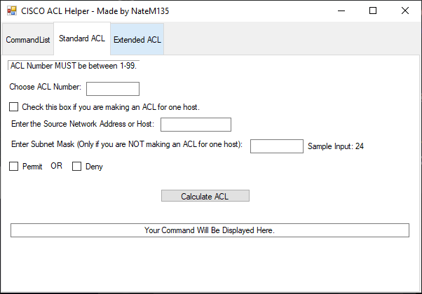
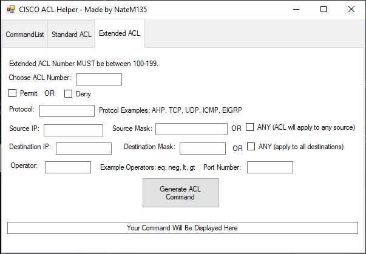
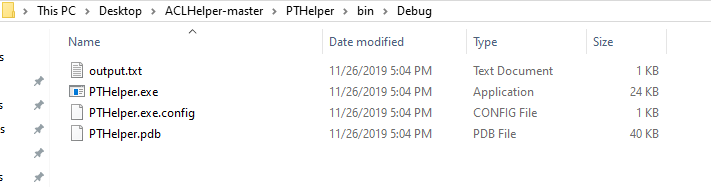

# ACLHelper 

**I know the project is called PTHelper but I'm too lazy to recommit with the correct file names.*

This program is a simple Cisco ACL Command Helper. 

Here is a picture of the GUI:

  
  
  
There are two types of ACLs that this program can help you build. They are standard and extended ACLs (NOT NAMED!).

Say for example you want to build a Standard ACL. Click the Standard ACL Tab and you will see this menu:

Fill out the paramters of the command. Here is an example: 

Once you add your command, it will then show up in the command list. You can do the same for Extended ACLs using the Extended tab. Here is a picture of what it should look like:

From the command list, you can export your commands to a txt file. This txt file is exported to the directory where the executable for the program is located. 

